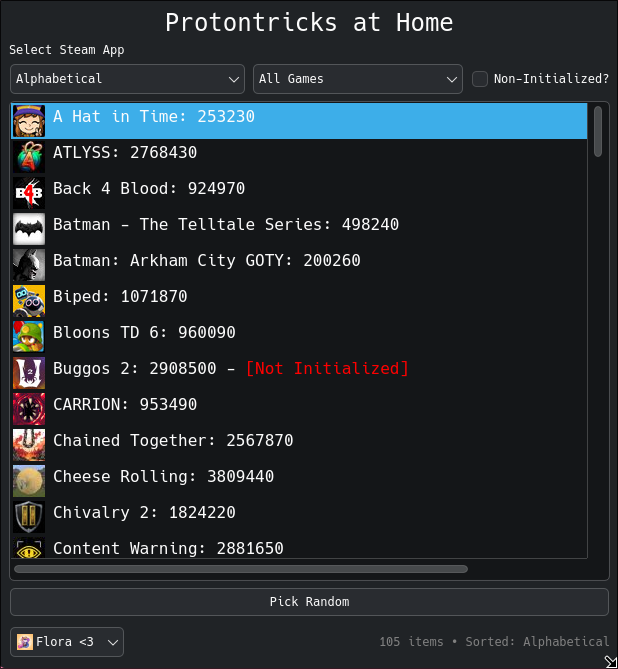
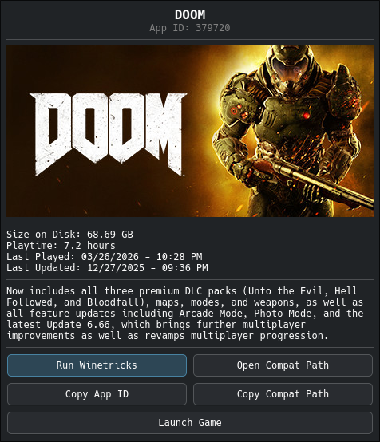

# Protontricks at Home

_"Mommmmm I want Protontricks!" .. "We have Protontricks at home sweetie.."_  
<br/>
<br/>
Essentially just a hobby-made knockoff of Protontricks made using Python / Qt6.. with a few fluffy features.  

Supports the following

- Comprehensive filtering
- - Filter based on title text / app id (typing will make the search bar appear automatically)
- - Filter alphabetically
- - Filter by last played
- - Filter by size on disk
- - Filter by playtime (both ascending and descending)
- - Filter by Steam installed games or Non-Steam Shortcuts
- - Filter by Non-Initialized prefixes (games that havent had their proton prefix properly created yet)  

- Randomly select a game when you dont know what to play  

- Switch to view libraries of other logged in Steam users without having to log-in again on Steam itself (limits launch functionality though)  

- Can launch the game from UI (utilizes Steam URI's for steam games and shortcuts alike)  

- Can copy / open the compatdata path for easier management of titles  
- - Can also copy App ID  

- And of course, can launch Winetricks in the selected game's proton prefix.


## Previews




## Requirements

- Python 3.10+ (was written with 3.14)
- PySide6
- vdf
- Steam client installed and logged in

## Installation

```bash
pip install -r requirements.txt
```
