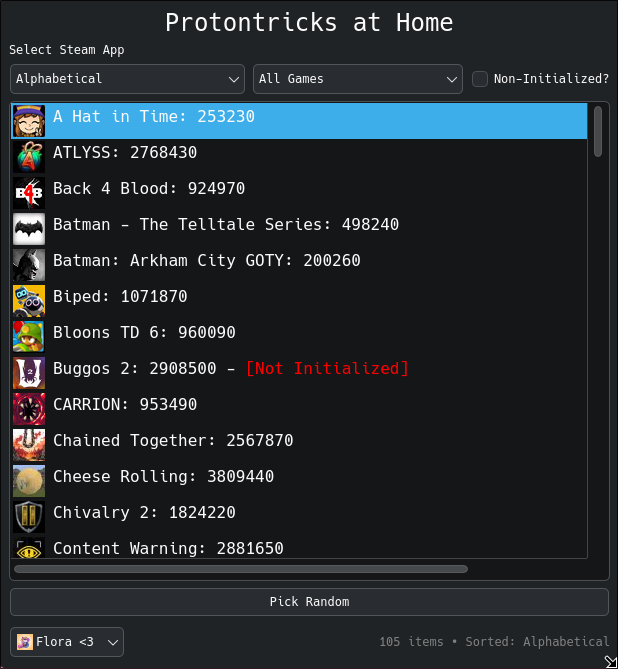
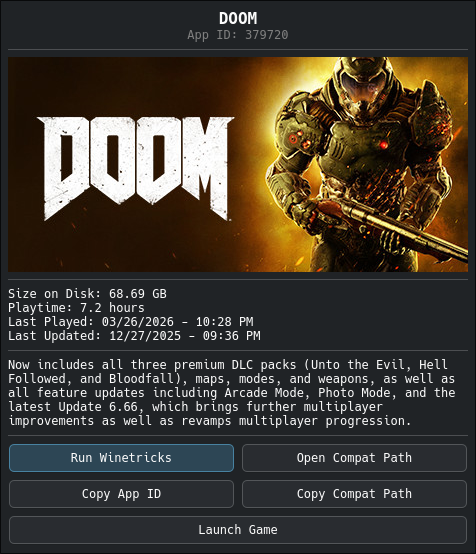

# Protontricks at Home

_"Mommmmm I want Protontricks!" .. "We have Protontricks at home sweetie.."_  
<br/>
<br/>
Essentially just a hobby-made knockoff of Protontricks made using Python / Qt6.. with a few fluffy features.  

## Features

### GUI Features

- **Comprehensive filtering & sorting**
  - Filter by title text / App ID (typing makes search bar appear automatically)
  - Sort alphabetically, by last played, size on disk, playtime (ascending/descending)
  - Filter by Steam games or Non-Steam Shortcuts
  - Filter by Non-Initialized prefixes (games that haven't had their Proton prefix created yet)

- **Random game picker** - Let the app choose when you don't know what to play (this was more for myself lmao)

- **User switching** - View libraries of other logged-in Steam users without re-authenticating

- **Launch games** directly from UI (uses Steam URI's for both Steam games and shortcuts)

- **Prefix management** - Copy or open compatdata paths, copy App IDs

- **Winetricks integration** - Launch Winetricks in any game's Proton prefix

### CLI Features

- **List all prefixes** - `list` command
- **Search for games** - `search` command with case-insensitive name matching
- **Run executables** - `run` command to execute any Windows program in a game's prefix
- **Launch games** - `launch` command to start games via Steam
- **Winetricks commands** - `winetricks` command to run any winetricks verb (EG: winecfg, vcrun2019)
- **Multiple Steam installation support** - Works with Native, Flatpak, and (hopefully?) Snap Steam
- **Environment variable support** - Use `STEAM_ROOT` to specify your Steam installation, or just `--steam-root` flag in CLI if you prefer

## Previews




## Requirements

- Python 3.7.5+ (written with 3.14.4 but tested and working on 3.7.5)
- PySide6
- vdf
- Steam client installed and logged in

## Installation

```bash
pip install -r requirements.txt
```

## Usage

### GUI Mode

Run without any arguments to default to GUI

```bash
python3 run.py
```

### CLI Mode

```bash
usage: run.py [-h] [-v] [-sr STEAM_ROOT]  ...

Protontricks at Home

options:
  -h, --help            show this help message and exit
  -v, --verbose         Enable verbose output
  -sr, --steam-root STEAM_ROOT
                        Path to specific Steam installation

Commands:
  
    list                List all prefixes
    search              Search for games
    winetricks          Run winetricks
    run                 Run executable
    launch              Launch game

Run without arguments to launch the GUI.

Environment Variables:
  STEAM_ROOT    Path to specific Steam installation (overrides auto-detection)

Examples:
  run.py list
  run.py --steam-root ~/.local/share/Steam list
  STEAM_ROOT=~/.var/app/com.valvesoftware.Steam/data/Steam run.py
  run.py search Skyrim
  run.py winetricks 12345 d3dx9
  run.py run 12345 ~/Downloads/installer.exe
  run.py launch 12345
```